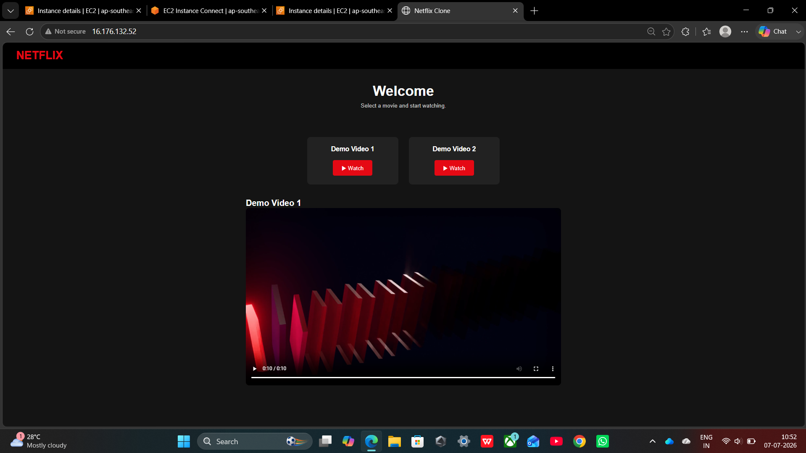
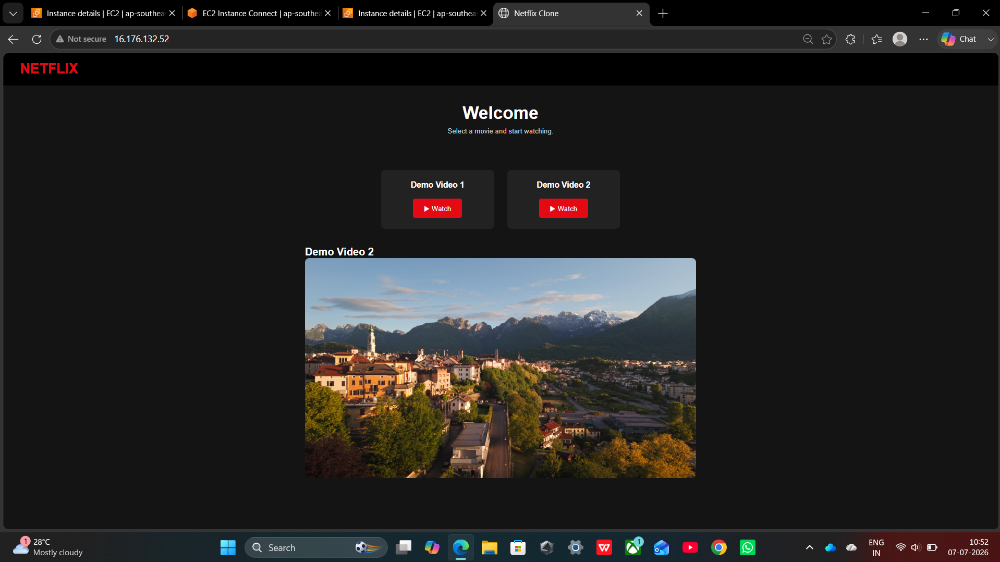
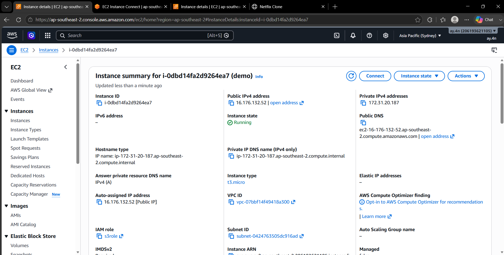
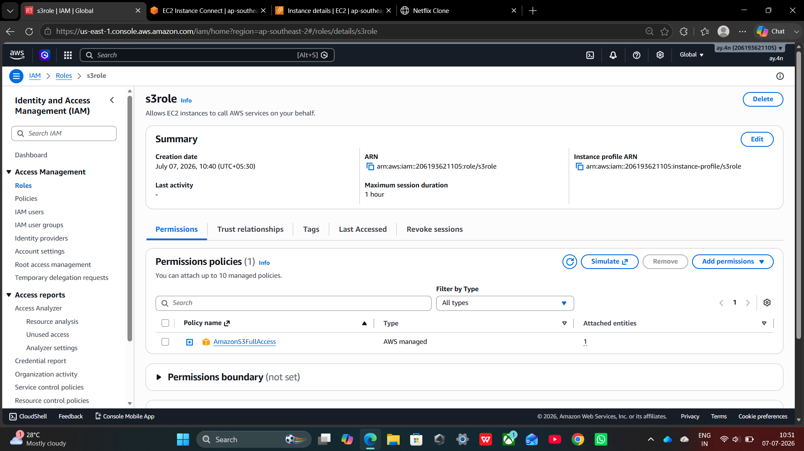
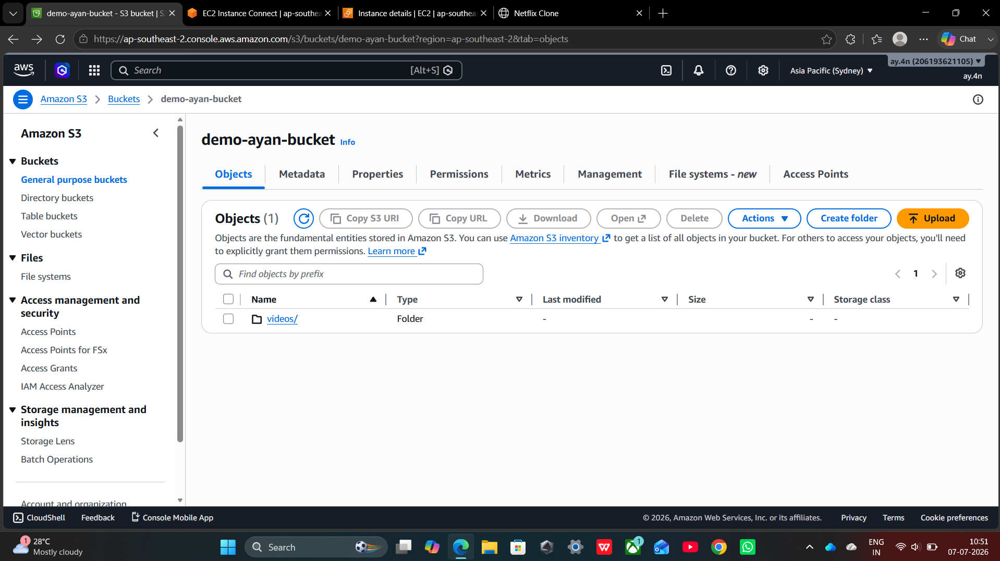
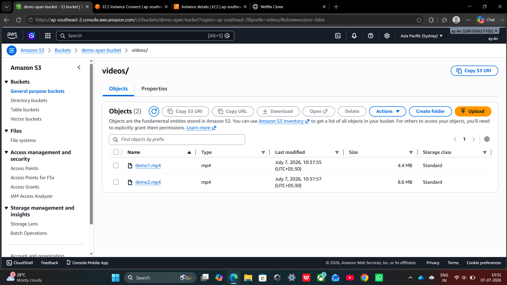

# 🎬 Netflix Clone on AWS

A simple Netflix-inspired video streaming web application built using **HTML with inline CSS and JavaScript**. The application is hosted on **Amazon EC2 using Apache HTTP Server (httpd)**, while video content is stored, streamed, and downloaded from **Amazon S3**.

---

## 📖 Project Overview

This project demonstrates how to deploy a static web application on Amazon EC2 and integrate it with Amazon S3 for media storage. It provides a clean, Netflix-inspired interface where users can **watch or download videos** directly from the browser.

---

## ✨ Features

- 🎬 Netflix-inspired user interface
- 📺 Stream videos directly from Amazon S3
- ⬇️ Download videos directly from Amazon S3
- ☁️ Hosted on Amazon EC2
- 🌐 Apache HTTP Server (httpd)
- 📱 Responsive single-page design
- ⚡ Lightweight implementation using a single HTML file
- 🔗 Direct integration between EC2 and Amazon S3
- 🎥 HTML5 video player with playback controls

---

## 🛠 Technologies Used

- HTML5
- Inline CSS
- Inline JavaScript
- Amazon EC2
- Amazon S3
- Apache HTTP Server (httpd)
- AWS IAM

---

## ☁️ AWS Architecture

```text
                User
                  │
                  ▼
        Amazon EC2 (Apache httpd)
                  │
                  ▼
      Netflix Clone (HTML Application)
                  │
                  ▼
      Amazon S3 Bucket (Video Storage)
          │                   │
          ▼                   ▼
   Video Streaming     Video Download
```

---

## 📁 Project Structure

```text
netflix-clone/
│
├── index.html
├── README.md
│
├── screenshots/
│   ├── app-overview1.png
│   ├── app-overview2.png
│   ├── ec2instance-overview.png
│   ├── iam-role.png
│   ├── s3bucket.png
│   └── s3bucket-overview.png
│
└── demo/
    └── endpoint.mp4
```

---

## 📷 Screenshots

### Application Overview





### Amazon EC2 Instance



### IAM Role



### Amazon S3 Bucket





---

## 🎥 Demo

A short screen recording demonstrating the application is included in this repository.

https://github.com/iamayan17/netflix-clone/blob/main/demo/endpoint.mp4

**Demo Video:** `demo/endpoint.mp4`

---

## 🚀 Deployment Steps

1. Launch an Amazon EC2 instance.
2. Install and configure Apache HTTP Server (httpd).
3. Upload `index.html` to the Apache web root.
4. Create an Amazon S3 bucket.
5. Upload the video files to Amazon S3.
6. Configure bucket permissions and CORS.
7. Update the S3 video URLs in `index.html`.
8. Access the application using the EC2 Public IP.
9. Stream or download videos directly from the web application.

---

## 🎯 Learning Outcomes

- Deploying a static website on Amazon EC2
- Configuring Apache HTTP Server (httpd)
- Using Amazon S3 for media storage
- Streaming videos from Amazon S3
- Downloading videos from Amazon S3
- Managing AWS IAM permissions
- Integrating EC2 with Amazon S3
- Building a cloud-based media streaming application

---

## 🌟 Future Enhancements

- User authentication
- Search functionality
- Movie categories
- Watch history
- Video thumbnails
- Multiple user profiles
- CloudFront integration
- Secure streaming using pre-signed URLs

---

## 👨‍💻 Author

**Ayan Ahmed**

GitHub: https://github.com/iamayan17

---

## ⭐ Support

If you found this project useful, consider giving it a **⭐ Star** on GitHub!
